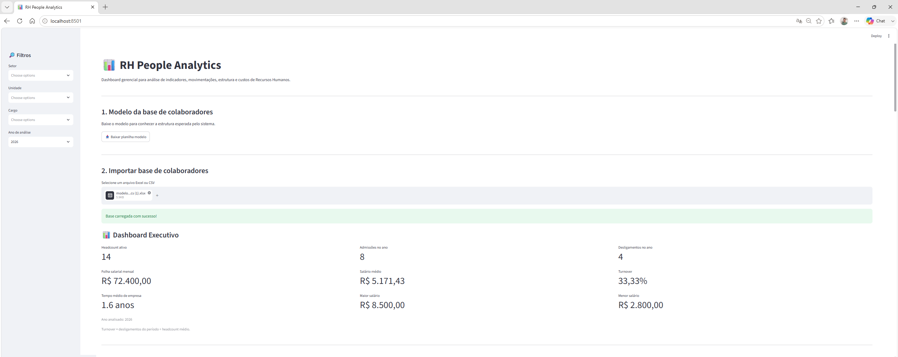
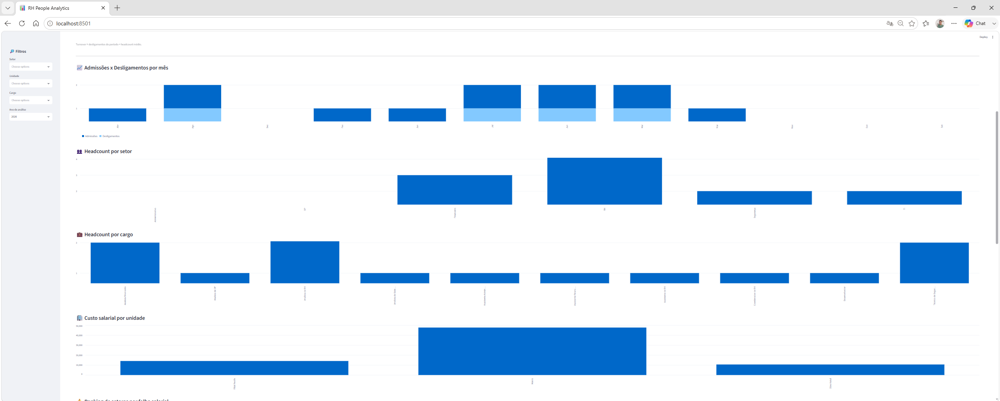
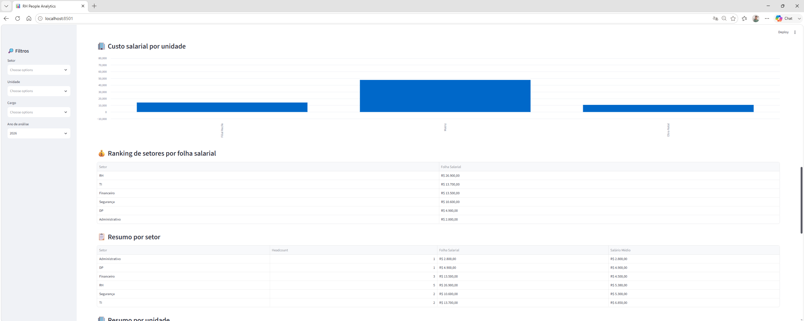
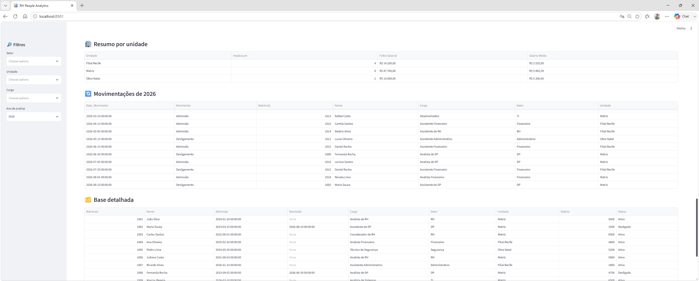
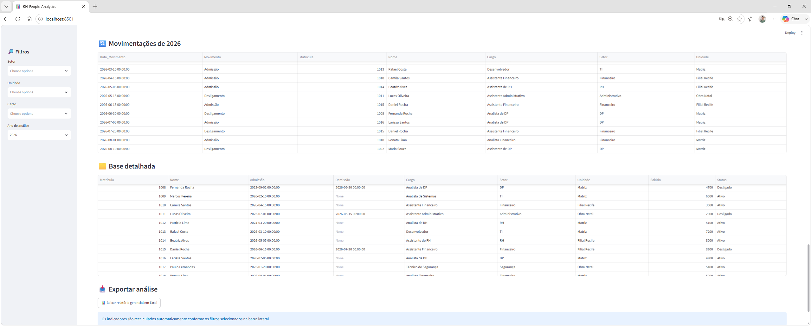

# 📊 RH People Analytics

Dashboard gerencial desenvolvido em **Python e Streamlit** para transformar bases de colaboradores em indicadores estratégicos de Recursos Humanos e Departamento Pessoal.

O projeto foi desenvolvido com foco em **People Analytics, gestão de pessoas, movimentação de colaboradores, estrutura organizacional e custos de pessoal**, permitindo que gestores de RH analisem rapidamente informações relevantes para tomada de decisão.

> **Versão atual: v0.3**

---

## 🎯 Objetivo do projeto

Muitas informações importantes de Recursos Humanos ainda são analisadas manualmente em planilhas.

O **RH People Analytics** foi criado para demonstrar como programação, automação e análise de dados podem transformar uma base operacional de colaboradores em um painel gerencial interativo.

A aplicação permite importar dados, aplicar filtros e gerar automaticamente indicadores, gráficos, análises e relatórios em Excel.

---

# 🖥️ Demonstração

## Dashboard Executivo



O painel apresenta de forma consolidada os principais indicadores da força de trabalho.

---

## 📈 Análises gráficas — Parte 1



---

## 📊 Análises gráficas — Parte 2



---

## 🔄 Movimentações e análises



---

## 📥 Base detalhada e exportação



---

## 📄 Demonstração completa

Para visualizar todo o dashboard em uma única apresentação:

[📊 Visualizar RH People Analytics completo em PDF](assets/rh-people-analytics.pdf)

---

# 📌 Principais indicadores

O Dashboard Executivo apresenta automaticamente:

- 👥 Headcount ativo
- ➕ Admissões no período
- ➖ Desligamentos no período
- 💰 Folha salarial mensal
- 💵 Salário médio
- 🔄 Turnover
- ⏳ Tempo médio de empresa
- 📈 Maior salário
- 📉 Menor salário

Os indicadores são recalculados automaticamente conforme os filtros selecionados.

---

# 🔎 Filtros disponíveis

A aplicação permite análise dinâmica por:

- Setor
- Unidade
- Cargo
- Ano de análise

Isso permite, por exemplo, visualizar apenas os indicadores de um determinado setor, unidade operacional ou grupo de cargos.

---

# 📊 Análises disponíveis

Além dos indicadores executivos, o sistema apresenta:

### Movimentação de pessoal

Comparativo mensal entre:

- admissões;
- desligamentos.

### Headcount

Distribuição dos colaboradores ativos por:

- setor;
- cargo;
- unidade.

### Custos de pessoal

Análises de:

- folha salarial por setor;
- custo salarial por unidade;
- salário médio;
- maior e menor salário.

### Estrutura organizacional

Resumos gerenciais por:

- setor;
- unidade.

### Movimentações detalhadas

Relação de admissões e desligamentos ocorridos no período selecionado.

---

# 🔄 Cálculo de Turnover

Na versão atual, o indicador utiliza a seguinte metodologia:

```text
Turnover (%) =
Desligamentos do período
------------------------- × 100
Headcount médio =
(Headcount no início do período + Headcount no final do período) / 2


